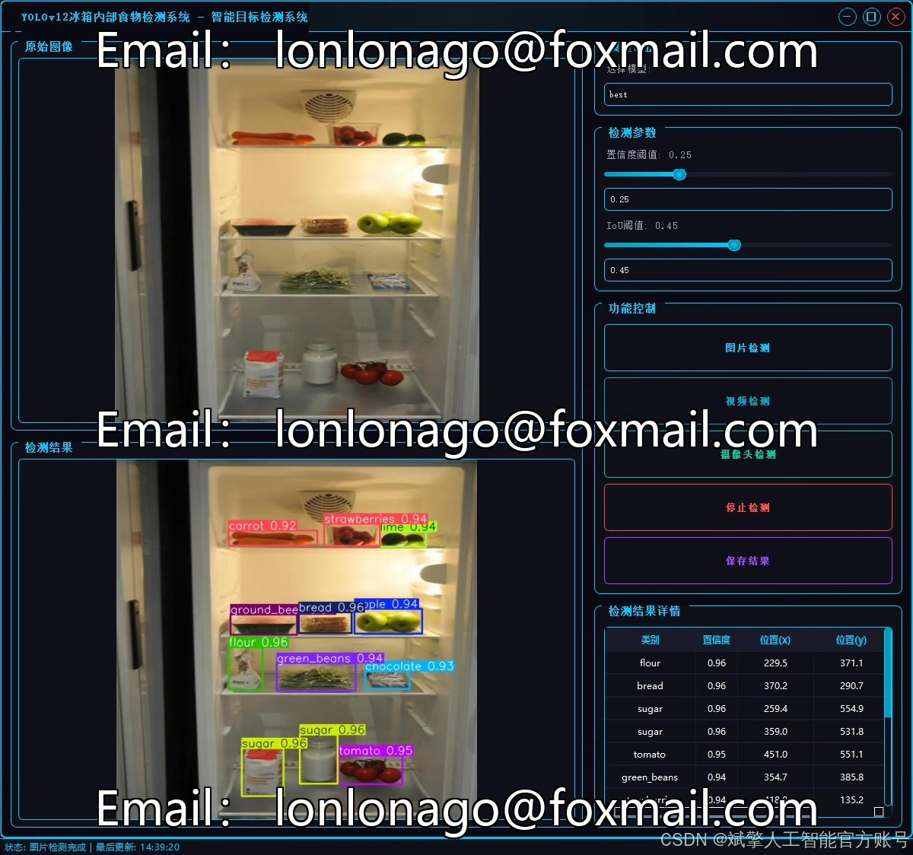
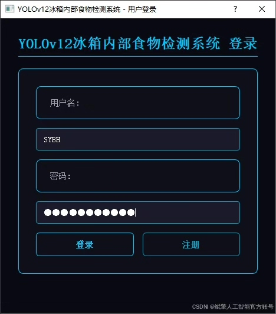
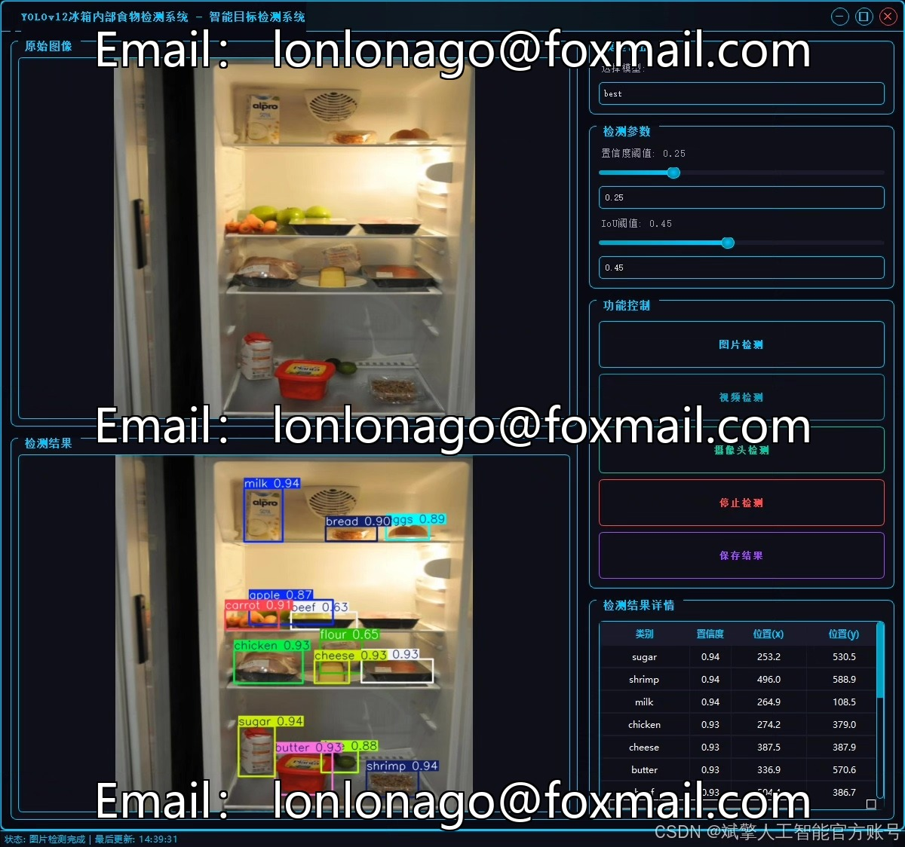
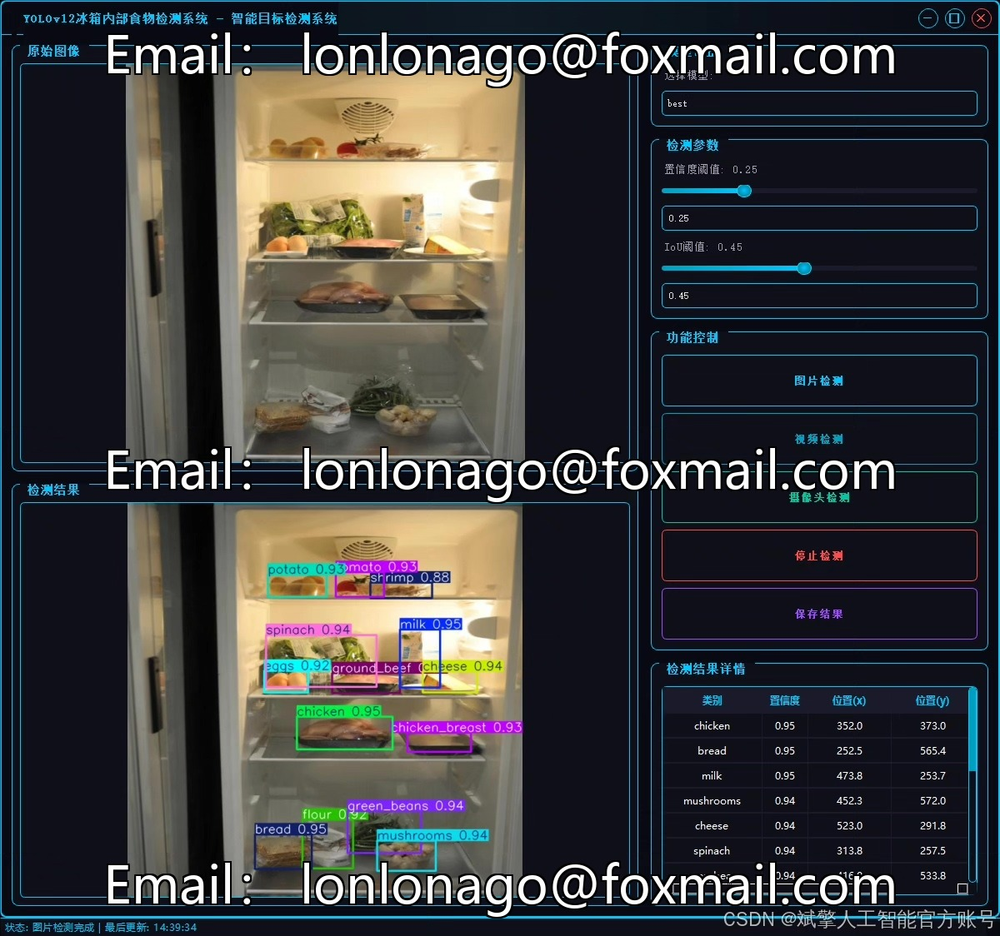
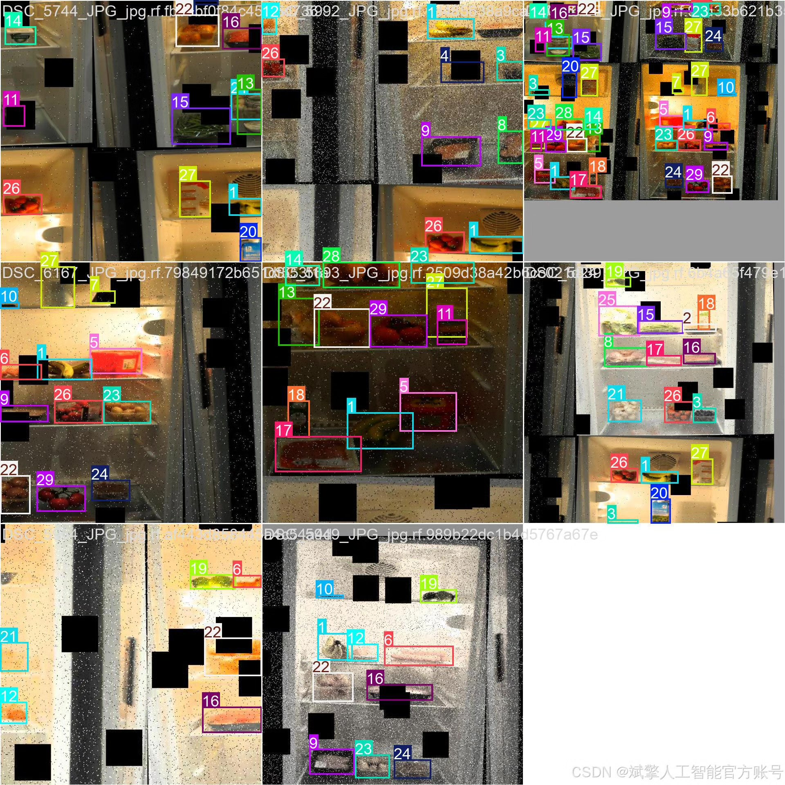
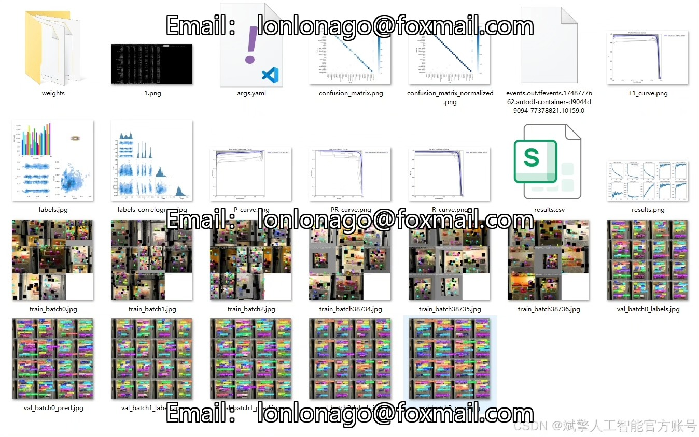
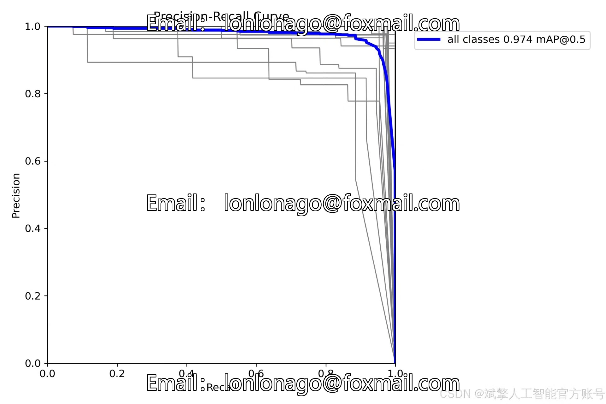
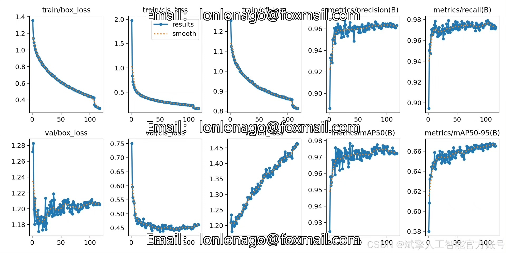
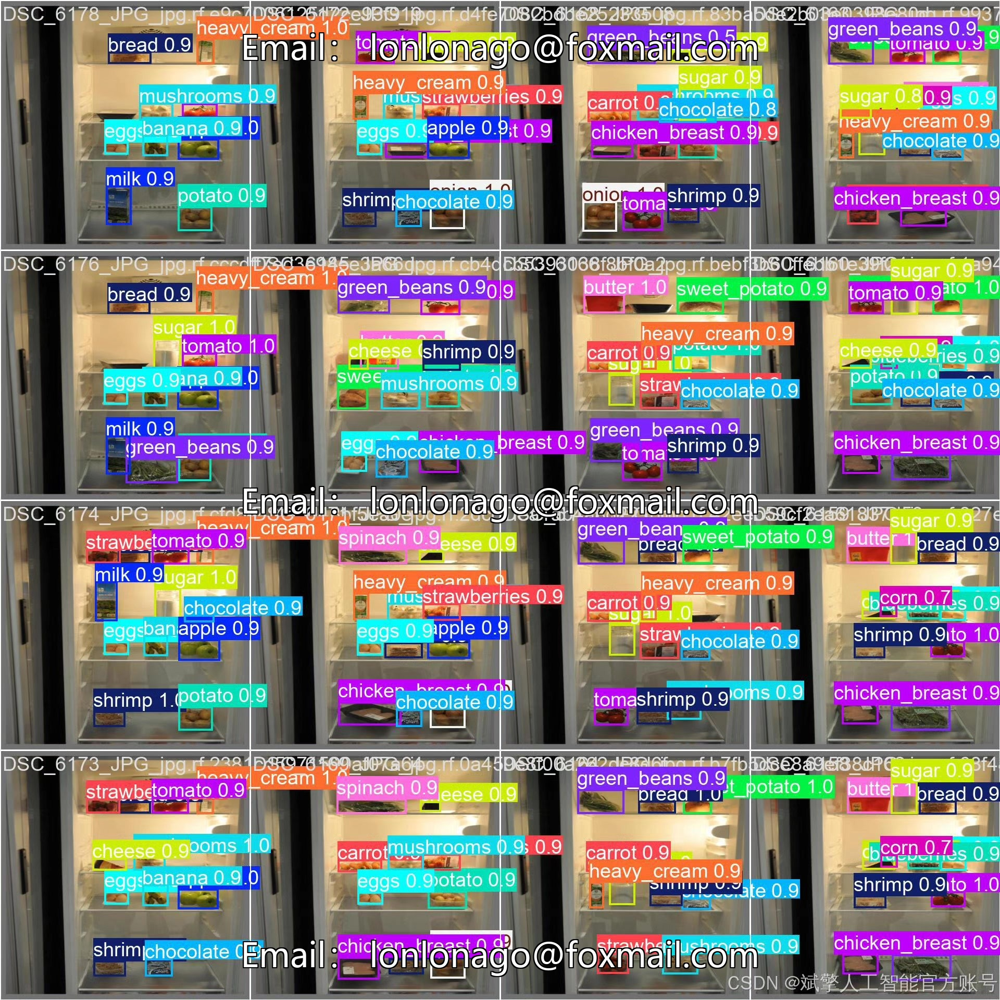

# YOLOv12 Refrigerator Food Identification System

## Body

YOLOv12 is a deep learning-based food recognition system for refrigerators. The system uses the YOLOv12 model, along with the YOLO dataset, to detect and identify food items in the refrigerator. It also includes a user interface (UI) for easy access to the system, as well as login and registration options. Additionally, the project includes Python code for the implementation of the system.

With the rapid development of smart home technology, refrigerators, as the core equipment for food storage in households, are facing increasing demands for intelligent management. Traditionally, food management in refrigerators relies on manual recording and regular inspection, which is not only inefficient but also prone to food waste due to forgetfulness or neglect. To address this issue, this project has developed a smart food detection and management system for refrigerators based on the YOLOv12 deep learning object detection algorithm. This system can automatically identify, classify, and manage 30 common foods in the refrigerator, providing a user-friendly interface for digital food inventory management.

The system adopts YOLOv12 as the core detection model. Compared with traditional YOLO series algorithms (such as YOLOv5, YOLOv8), YOLOv12 has been optimized in terms of detection accuracy and inference speed, allowing for more efficient handling of complex scenes within a refrigerator with multiple targets and categories. The system supports recognition of 30 common food items, including fruits (such as apples, bananas, strawberries), vegetables (such as carrots, onions, spinach), meats (such as beef, chicken, ham), dairy products (such as milk, cheese, butter), and other common ingredients (such as eggs, flour, chocolate, etc.).

Dataset:
nc: 30 classes,
Names: ['apple', 'banana', 'beef', 'blueberries', 'bread', 'butter', 'carrot', 'cheese', 'chicken', 'chicken_breast', 'chocolate', 'corn', 'eggs', 'flour', 'goat_cheese', 'green_beans', 'ground_beef', 'ham', 'heavy_cream', 'lime', 'milk', 'mushrooms', 'onion', 'potato', 'shrimp', 'spinach', 'strawberries', 'sugar', 'sweet_potato', 'tomato'],
Number of datasets: Training set 2896 images, Validation set 103 images, Test set 51 images.

✅ User Login and Registration: Supports password detection and security verification.
✅ Three detection modes: Based on the YOLOv12 model, supports image, video, and real-time camera detection, accurately identifying targets.
✅ Dual-screen comparison: Displays the original screen and detection results simultaneously.
✅ Data visualization: Real-time table displays the category, confidence, and coordinates of detected targets.
✅ Intelligent parameter adjustment: Offers a confidence slide bar to dynamically optimize detection accuracy, adapting to different scene requirements.
✅ Sci-fi style interface: Dark theme combined with dynamic light effects, reducing visual fatigue and enhancing operational experience.

## Images

## Payment

Here is a pay link on Stripe ( https://buy.stripe.com/3cs8yP7sY87d0vu9AB ). Please contact me lonlonago@foxmail.com after funding $89, and I will send you a complete data files , thank you!

